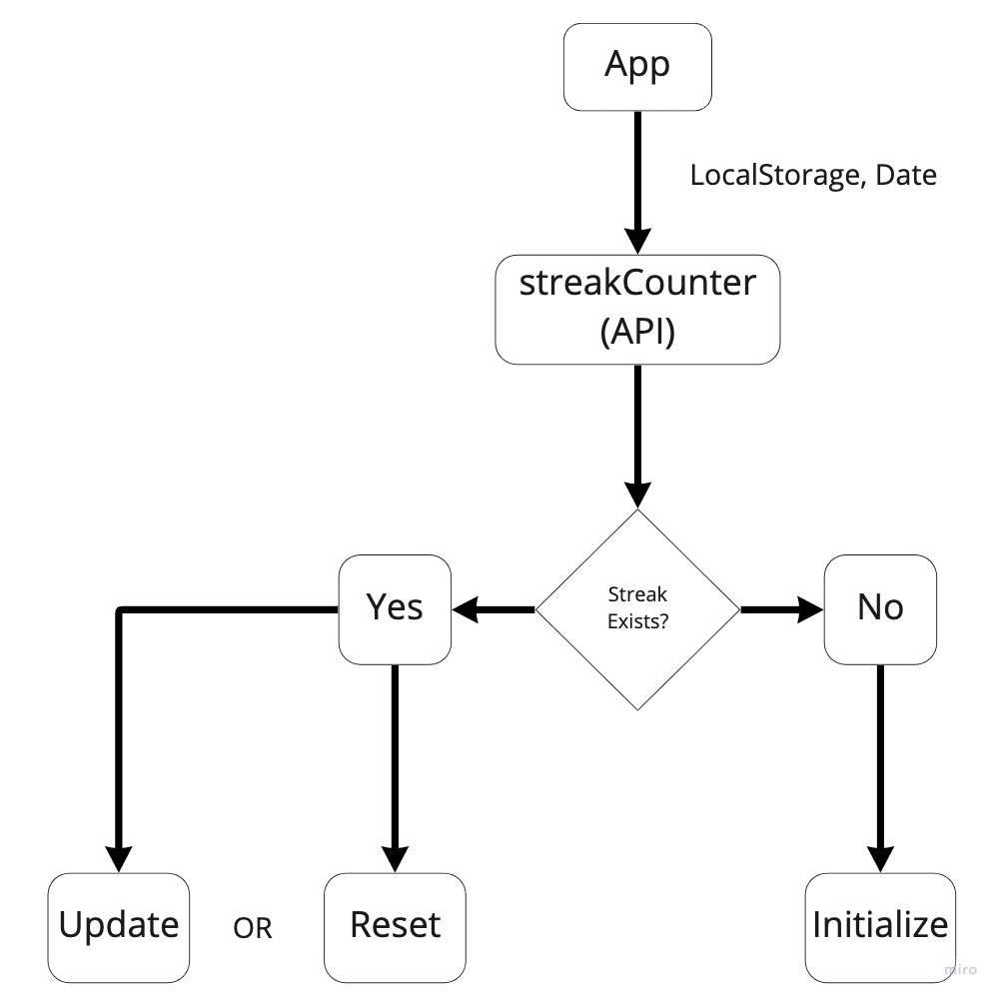

# streak counter

This project was bootstrapped with [Create React App](https://github.com/facebook/create-react-app).

## Available Scripts

### `npm start` Runs the app in the development mode

### `npm test` Launches the test runner in the interactive watch mode

### `npm run build` Builds the app for production to the `build` folder

## Libraries used

 `@jsjoeio/streak-counter` - a basic streak counter
  `ts-jest` is a Jest transformer

## Streak Counter Requirements

what is a streak?

- happens when a user does something for a subsequent amount of time(secs, mins, hrs, days, weeks...)

how to break a streak?

- the user stops doing something

Visual

  
